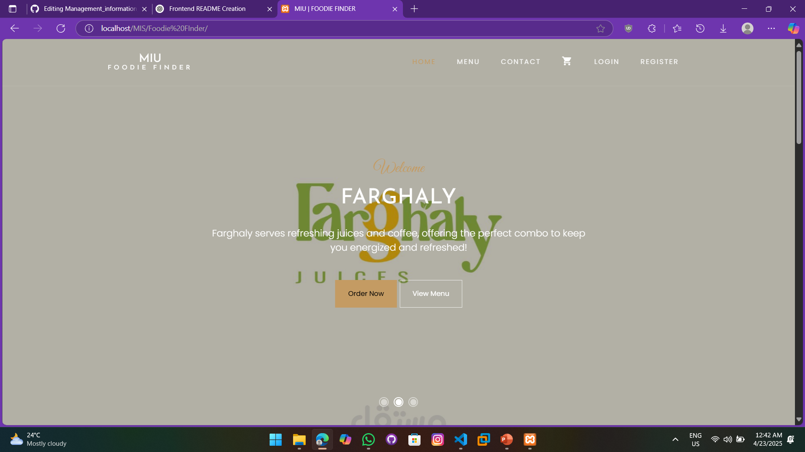
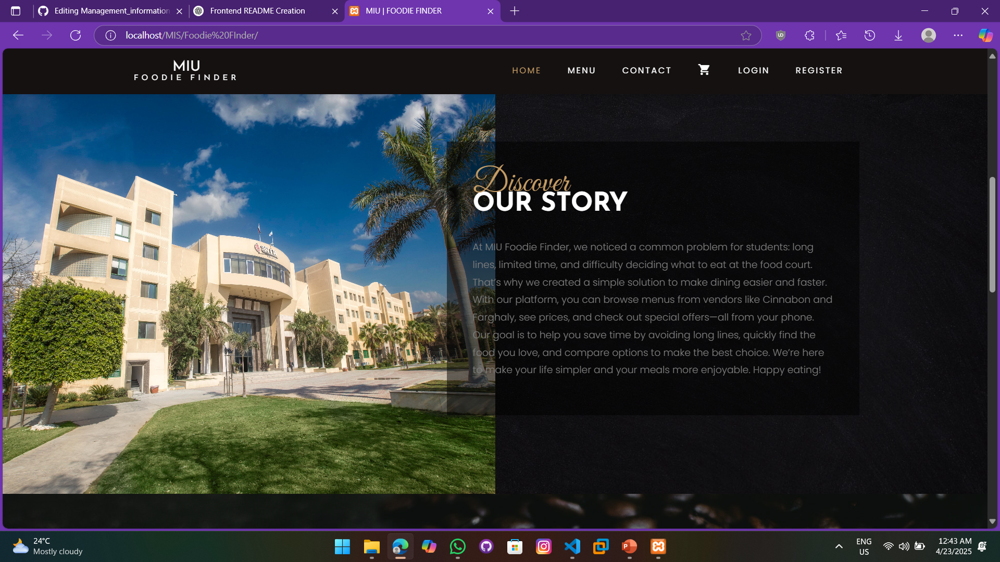
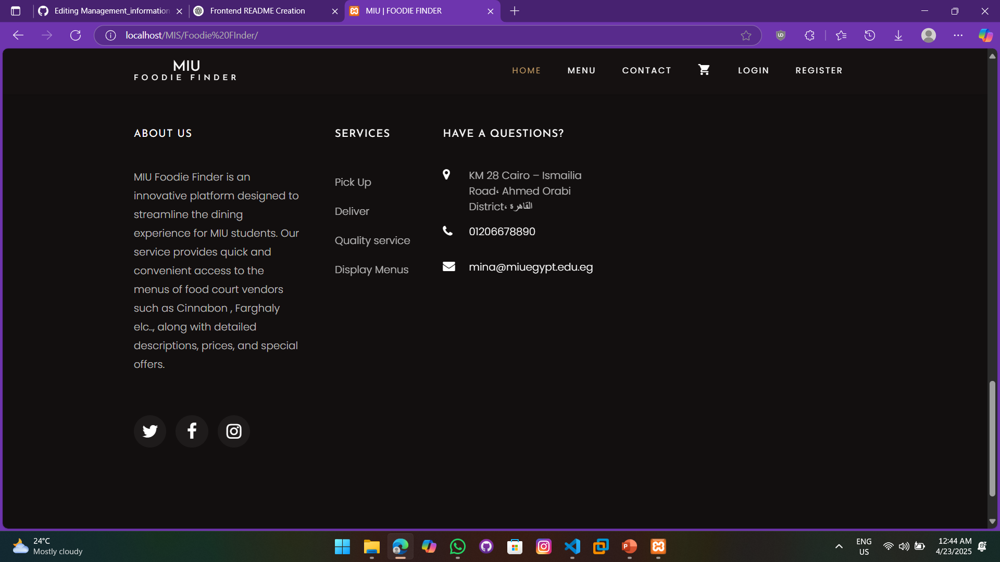
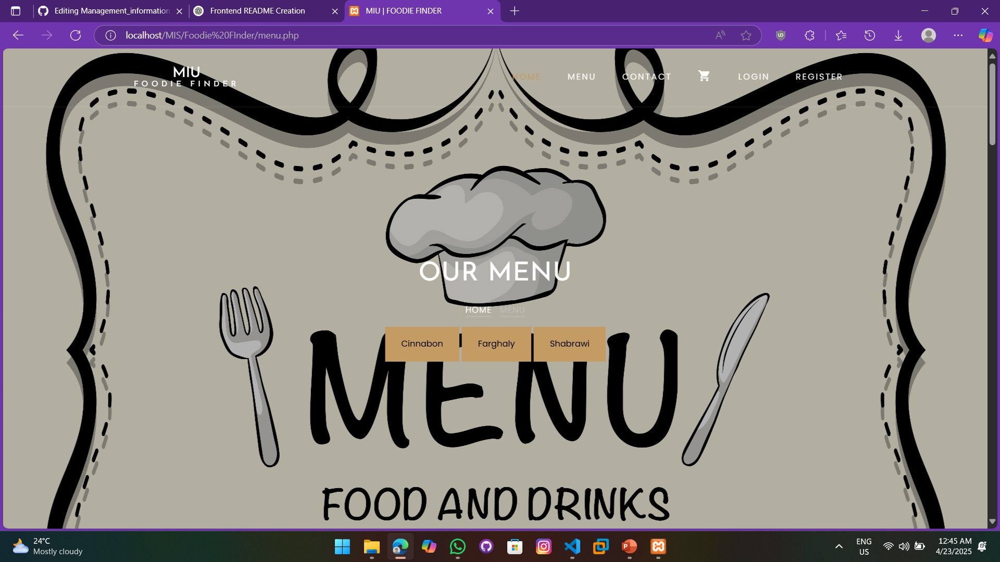
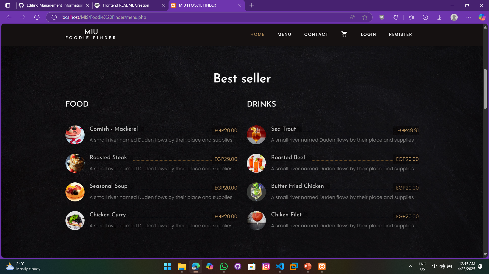
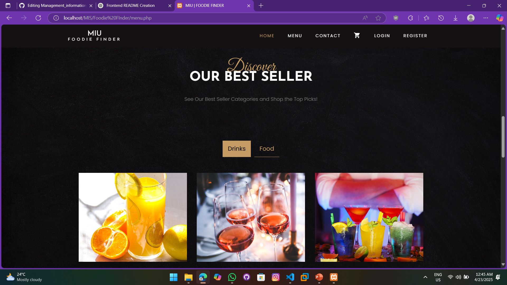
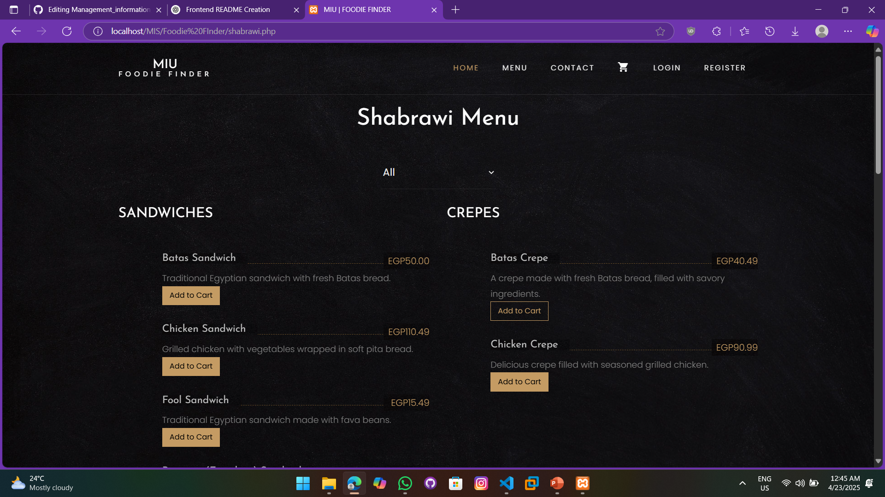
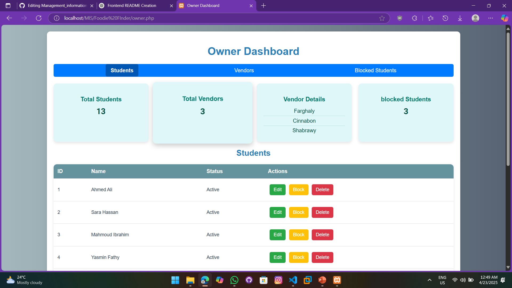
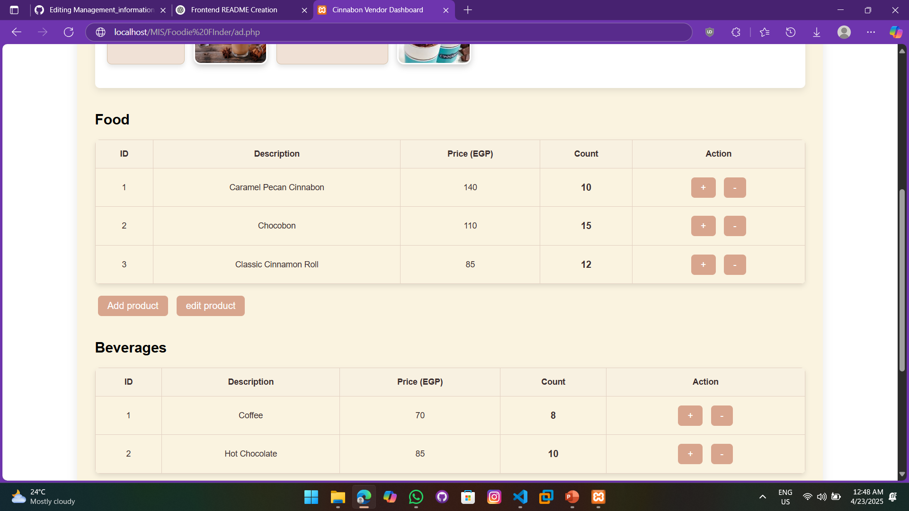
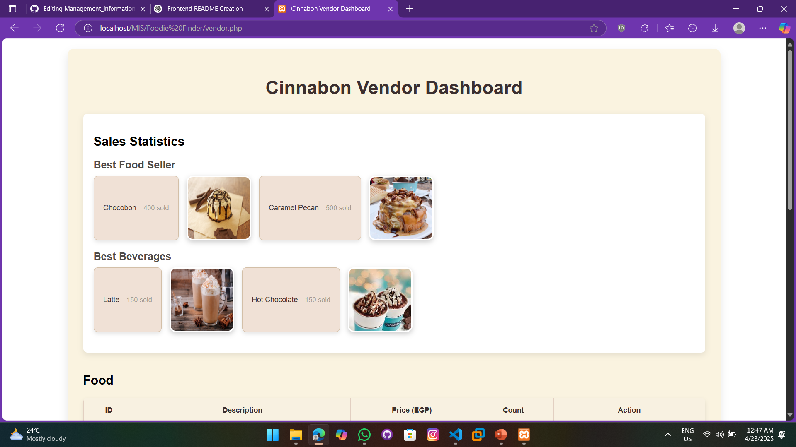

# MIU Foodie Finder 🍽️

A smart and user-centric digital menu and food ordering platform designed for MIU students and staff. This is the **frontend implementation** of the project, providing a seamless interface for users to browse food options, place orders, and stay updated in real-time.

---

## 🚀 Project Overview

MIU Foodie Finder addresses common pain points like long queues, inconsistent menus, and slow service. Our solution includes:

- A centralized digital menu for all university food vendors
- Real-time updates and availability
- Smart search and filtering
- Pickup and delivery options
- Multi-method payments (InstaPay, Cash, Credit Card)

---

## 📸 Screenshots

### 🖥️ landing page 

### 📱 Menu Preview

### 📊 Admin Panel

### 📊 vendor Panel

---

